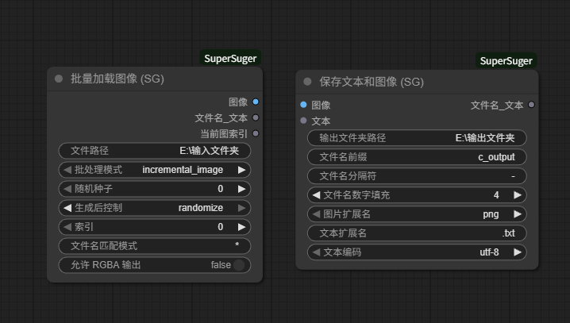
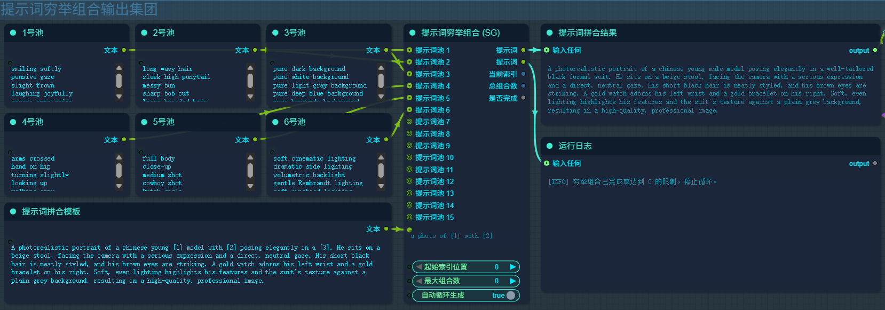
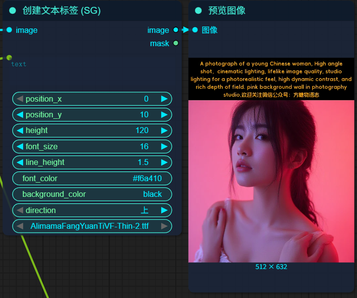

本项目为 ComfyUI 辅助插件，本插件目标是通过聚合实用的节点工具，减少安装和配置的复杂度，提高工作效率。通过参考其他插件，使用 AI 编程工具辅助完成，欢迎提供实用的节点以增加插件的功能。

# 更新日志

## log20251023

1. 新增指定目录批量加载图片，支持通过随机值和运行次数结合加载指定文件夹中的所有图片
2. 新增同时保存文本和图像，支持自定义文件名前缀，分隔符，后缀，文本编码，指定保存目录
   

## log20251130

1. 新增用于对多个提示词池进行穷举组合的提示词穷举组合节点，此节点可将多个提示词池的提示词按自定义的提示词载入模板进行穷举组合，生成所有可能的提示词，自动提交到生成队列中，支持指定最大组合数量和中断续接功能。
2. 新增多行文本框，用于输入多个提示词池，每个提示词池占一行。
3. 提示词池中的每个提示词占一行，提示词模板中使用[1],[2]等锚点标识插入位置，提示词池没有写的锚点的提示词池就算连接上也不参与组合。
   

## log20251201

1. 新增创建文本标签节点，用于在图像上创建文本标签，支持自定义文本内容，位置，字体，字体大小，行高，字体颜色，背景颜色，方向等参数。
   

# 手动安装方法

1. 下载本插件的压缩包
2. 解压压缩包到 `ComfyUI/custom_nodes` 文件夹中
3. 重启 ComfyUI 即可

# 使用方法

使用 comfyui 快速搜索框，输入关键词 SG 可快速定位节点,例如：

- 批量加载图片的节点名为：SG_BatchImageLoader，中文名为：批量加载图像 (SG)。
- 同时保存文本和图像的节点名为：SG_ImageWithTextSaver，中文名为：保存文本和图像 (SG)。

# 支持界面中文

1. 首先需要安装汉化插件 [ComfyUI-DD-Translation](https://github.com/Dontdrunk/ComfyUI-DD-Translation)
2. 将 `translation\zh-CN\Nodes` 文件夹中的 `ComfyUI-SuperSuger.json` 文件复制到 `ComfyUI/custom_nodes/ComfyUI-DD-Translation/zh-CN/Nodes` 文件夹中
3. 重启 ComfyUI 即可

# 作者主页

# 鸣谢

1. 提示词穷举组合节点的自动队列功能参考了台湾开发者的项目，找不到他的项目了，以后找到了再加上他的项目链接。
2. 添加文本标签功能基于 kjnodes 新增了行高和下方覆盖：https://github.com/search?q=kjnodes&type=repositories
